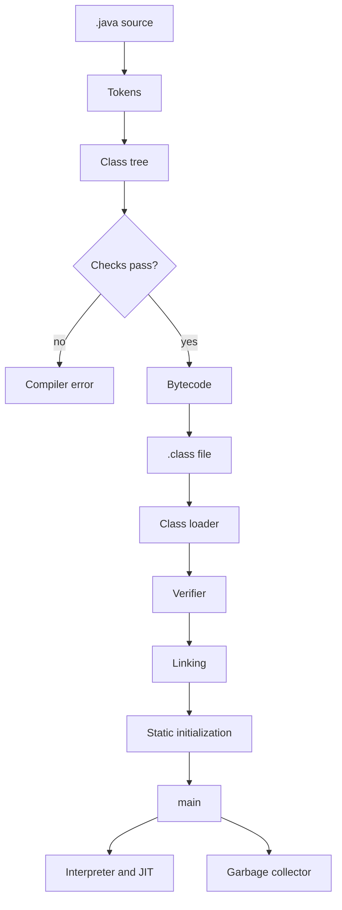
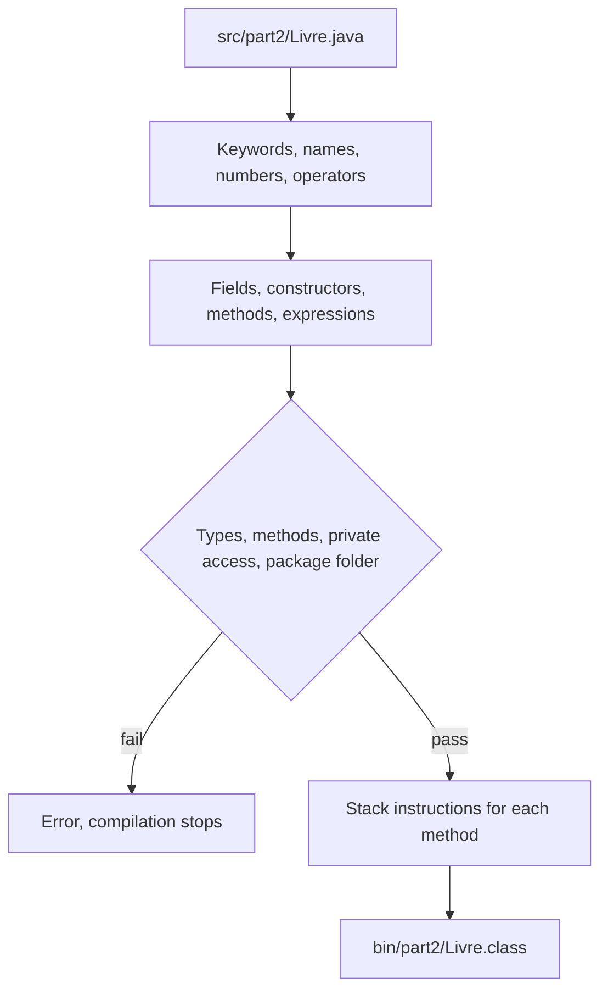

# estm-2026-java-tps

A Java program starts as source code, becomes bytecode, then runs on the Java Virtual Machine (JVM).



## How Java runs

1. You write a class in a `.java` file. The public class name matches the file name: the class `Livre` is in `Livre.java`.
2. `javac` compiles that source into bytecode, a `.class` file. Compilation checks the code. It does not run the program.
3. `java` starts the JVM. The JVM loads the `.class` file and calls the entry point:

```java
public static void main(String[] args)
```

The same bytecode runs on any machine that has a JVM. `javac` and `java` come from the JDK.

A package is a folder of classes. The first line of the file names that package, and the folder path must match it. `src/part1/CarnetDeNotes.java` begins with `package part1;` and is launched as `part1.CarnetDeNotes`.

## The compiler

`javac` translates Java source into bytecode. It never executes `main`.



1. It reads the `.java` file and splits it into tokens: keywords, names, numbers, operators.
2. It builds a tree of the class: fields, constructors, methods, and the expressions inside them.
3. It checks that tree. Types must match, called methods must exist, `private` members stay inside the class, and `package part2;` must sit in the folder `part2`. A failed check stops the compilation and prints the error.
4. It turns each method into bytecode, instructions for a stack machine. For `estValide`, the instructions load `note`, compare it with `0` and `20`, and leave `true` or `false` on the stack.
5. It writes one `.class` file per class. `src/part2/Livre.java` becomes `bin/part2/Livre.class`. That file stores the class name, the fields (`titre`, `auteur`, `isbn`, `emprunte`, `nbLivres`), and the bytecode of each constructor and method.

`-d bin` chooses the output folder. The package name decides the subfolder, so `part2.Livre` is stored as `bin/part2/Livre.class`.

## The JVM

`java -cp bin part2.Main` starts a JVM and names the class that contains `main`. The classpath (`-cp bin`) is the list of folders where `.class` files are searched.

```mermaid
flowchart TD
  cmd["java -cp bin part2.Main"] --> load["1. Class loader reads Main.class"]
  load --> verify["2. Verifier checks bytecode"]
  verify --> link["3. Linking loads Bibliotheque and Livre"]
  link --> init["4. Static init sets nbLivres to 0"]
  init --> call["5. Call Main.main"]
  call --> heap["Heap: Livre objects"]
  call --> stack["Stack: local variables and calls"]
  heap --> exec["6. Interpreter, then JIT"]
  stack --> exec
  heap --> gc["7. Garbage collector"]
```

1. The class loader looks up `bin/part2/Main.class` and reads its bytes.
2. The verifier checks that bytecode before it runs: the operand stack is used correctly, types match, and the class does not break access rules.
3. Linking connects the class to the others it names. Loading `Main` leads to `Bibliotheque`, then to `Livre`, the first time each one is used.
4. Initialization runs the static setup once. In `Livre`, `nbLivres` starts at `0` before any constructor increments it.
5. The JVM calls `Main.main`. `new Livre(...)` allocates the object on the heap and runs the constructor. Local variables and the call chain live on the thread's stack.
6. The interpreter executes the bytecode instruction by instruction. The JIT compiler turns methods that run often into native instructions for the CPU, so later calls skip interpretation.
7. The garbage collector frees heap objects that no variable still references. You do not free them yourself.

`java` is the launcher. The JVM is the program that loads, checks, and executes the bytecode.

## In this repository

Sources live under `TP001/ex1/src`. Compiled classes go to `TP001/ex1/bin`.

| Folder | Program |
| --- | --- |
| `src/part1` | Carnet de notes: static methods called from `main` |
| `src/part2` | Bibliothèque: objects created with `new` (`Livre`, `Bibliotheque`) |

From `TP001/ex1`:

```bash
javac -d bin src/part1/*.java
java -cp bin part1.CarnetDeNotes
java -cp bin part1.TestCarnetDeNotes

javac -d bin src/part2/*.java
java -cp bin part2.Main
java -cp bin part2.TestBibliotheque
```

`-d bin` writes the `.class` files into `bin` and keeps the package folders. `-cp bin` tells the JVM to load classes from `bin`.
