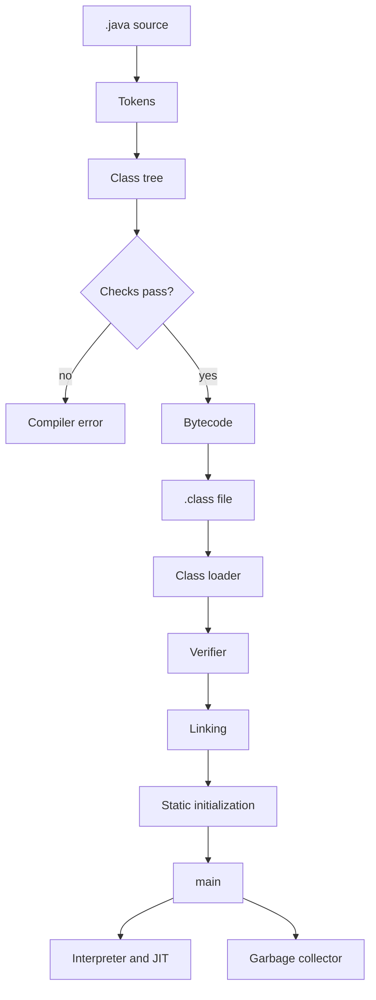
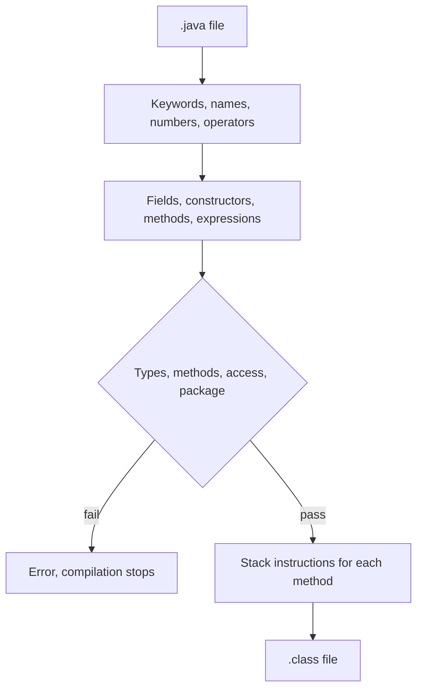

# estm-2026-java-tps

A Java program starts as source code, becomes bytecode, then runs on the Java Virtual Machine (JVM).



## How Java runs

1. You write a class in a `.java` file. The public class name matches the file name.
2. `javac` compiles that source into bytecode, a `.class` file. Compilation checks the code. It does not run the program.
3. `java` starts the JVM. The JVM loads the `.class` file and calls the entry point:

```java
public static void main(String[] args)
```

The same bytecode runs on any machine that has a JVM. `javac` and `java` come from the JDK.

A package is a folder of classes. The first line of the file names that package, and the folder path must match it. The class is launched with its package name, for example `java com.example.App`.

## The compiler

`javac` translates Java source into bytecode. It never executes `main`.



1. It reads the `.java` file and splits it into tokens: keywords, names, numbers, operators.
2. It builds a tree of the class: fields, constructors, methods, and the expressions inside them.
3. It checks that tree. Types must match, called methods must exist, access rules must hold, and the package must match the folder. A failed check stops the compilation and prints the error.
4. It turns each method into bytecode, instructions for a stack machine. The instructions load values, compute, and leave the result on the stack.
5. It writes one `.class` file per class. That file stores the class name, the fields, and the bytecode of each constructor and method.

## The JVM

`java` starts a JVM and names the class that contains `main`. The classpath is the list of folders where `.class` files are searched.

```mermaid
flowchart TD
  cmd["java ClassName"] --> load["1. Class loader reads the .class file"]
  load --> verify["2. Verifier checks bytecode"]
  verify --> link["3. Linking loads the classes it uses"]
  link --> init["4. Static initialization runs once"]
  init --> call["5. Call main"]
  call --> heap["Heap: objects"]
  call --> stack["Stack: local variables and calls"]
  heap --> exec["6. Interpreter, then JIT"]
  stack --> exec
  heap --> gc["7. Garbage collector"]
```

1. The class loader finds the `.class` file on the classpath and reads its bytes.
2. The verifier checks that bytecode before it runs: the operand stack is used correctly, types match, and the class respects access rules.
3. Linking connects the class to the other classes it names, loading each one the first time it is used.
4. Initialization runs the static setup once, before any instance of the class is used.
5. The JVM calls `main`. `new` allocates an object on the heap and runs the constructor. Local variables and the call chain live on the thread's stack.
6. The interpreter executes the bytecode instruction by instruction. The JIT compiler turns methods that run often into native instructions for the CPU, so later calls skip interpretation.
7. The garbage collector frees heap objects that no variable still references.

`java` is the launcher. The JVM is the program that loads, checks, and executes the bytecode.
